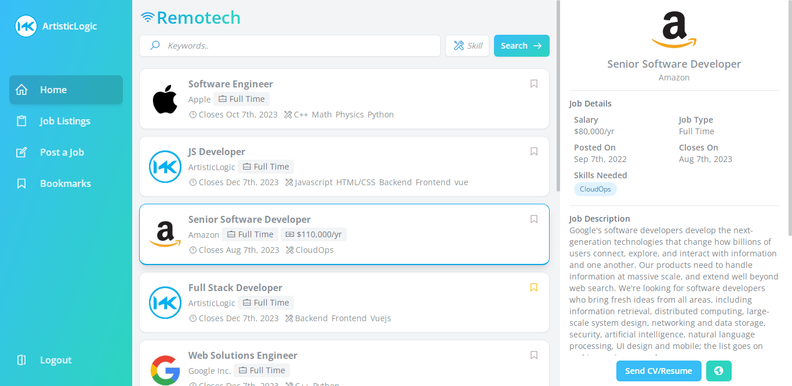

<h1 align="center">Remotech</h1>

<p align="center"></p>

<h3 align="center">
Remotech is a comprehensive job listing and search application that provides a fast and modern user experience for both job employers and work searchers.
</h3>


<h4 align="center">
<br>
Made with


<br/>
</h4>
<br>

<h3>
<strong>Links</strong>

<a href="remotech.fly.dev" target="_blank">View the app in action.</a>

<a href="https://www.behance.net/gallery/152242029/Remotech-Job-Search-Web-App" target="_blank">Check out more screenshots on behance.</a>
</h3>
<br>

## Project setup
-----
### Setup laravel and all dependecies:
```
composer install
```
### Install frontend assets (Uses Laravel Mix):
```
npm install
```

### Start laravel development server:
```
php artisan serve
```

### Load frontend for development
```
npm run dev //build frontend once for dev
npm run watch //build on watch for dev
npm run hot //Compiles and hot-reloads for dev
npm run prod //Compiles frontend for production
```
> Rename .env.example to .env and set your own database info. Sqlite is used as the default database which comes with some preloaded data. 
